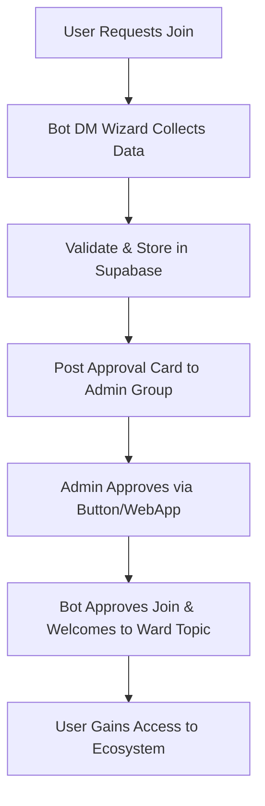
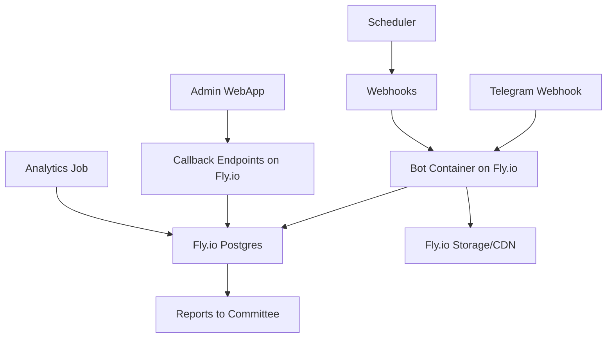
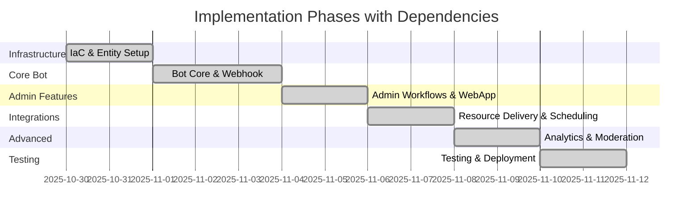

# Erdington Telegram Powerhouse Architectural Plan

## Executive Overview

The Erdington Telegram Powerhouse project delivers a complete, one-shot Telegram communications platform for Reform UK Erdington. This unified ecosystem integrates a public news channel, community forum with ward-specific topics, volunteer operations supergroup, committee war-room, and admin approvals room—all gated by manual admin approval with membership verification. Designed for immediate deployment without future iterations, it includes onboarding wizards, resource delivery (maps/PDFs), automated analytics, GDPR compliance, and a Telegram WebApp admin console. The platform uses Fly.io for containerized deployment with built-in Postgres database and secrets management, Node.js/TypeScript with grammY for the bot, and Fly.io storage/CDN for file hosting with database tables for ledgers. This one-shot approach ensures a production-grade, ward-first structure ready for community scaling, with built-in stubs for future connectors like X/Facebook cross-posting.

High-level goals:
- Secure, verified user onboarding with external membership checks and zero-friction admin approvals.
- Efficient admin workflows via WebApp console for queue management, member search, and audit logs.
- Instant ward-specific resource access via bot commands.
- Full GDPR compliance with deletion timers and audit trails.
- Automated content scheduling, cross-posting, and weekly analytics digests.
- Ward-centric architecture promoting local engagement while mitigating risks like abuse or data exposure.

The system scales seamlessly for community growth, emphasizing a one-shot readiness with no pending features or scope creep.

## System Architecture

The architecture adopts a serverless, event-driven model on Fly.io with built-in services:
- **Runtime**: Fly.io containerized services for bot and webapp, with global scaling.
- **Language/Stack**: Node.js 20 with TypeScript; grammY for Telegram bot API.
- **Datastore**: Fly.io Postgres for user/member data, join requests, posts, and events; built-in security enforced.
- **Secrets Management**: Fly.io secrets for bot tokens and IDs.
- **Scheduling/Jobs**: Fly.io cron jobs triggering webhooks for cron tasks (e.g., analytics digests).
- **Storage**: Fly.io storage/CDN for ward maps/PDFs with signed links; database tables for ledgers.
- **Analytics/Dashboards**: Built-in Fly.io metrics or integrated tools; dashboards via webapp.
- **Admin Interface**: Telegram WebApp (React + Vite) served from Fly.io.
- **Integrations**: Telegram API for bot/webhook, external membership check URL.
- **CI/CD**: GitHub Actions for lint/test/build/deploy to Fly.io, with IaC via Fly.io configs.

### Workflow Diagram

### Data Flow Diagram

## Detailed Components

### Bot (grammY-based)
- Handles join requests, DM wizards, commands (/map, /member), approvals/rejections.
- Webhook endpoint: /telegram/webhook.
- State management via Supabase for multi-step wizards.
- Integrates with Telegram entities (pre-created channels/groups/topics).
- One-shot features: Flood/URL filters, moderation commands (/mod mute/ban), GDPR /erase with retention.

### WebApp Admin Console
- React WebApp for queue management, member search, audit logs.
- Opened via inline buttons; auth via Telegram user IDs.
- Views: Pending joins (filter by ward), members, audit timeline.
- Role-based: Superadmins global; Ward Leads ward-specific.
- Fully integrated for approvals without leaving Telegram.

### Data Model
- **members/{telegram_user_id}**: Profile, status, audit log (Fly.io Postgres table).
- **join_requests/{req_id}**: Request details, status.
- **posts/{post_id}**: Metrics for scheduled content.
- **events/{event_id}**: Event data with rota.

### Integrations
- Fly.io storage/CDN: Ward packs (PDF/PNG/CSV).
- Fly.io Postgres tables: Membership ledger, content log.
- External system: Membership verification via deep-link.
- Analytics: Telegram stats + short-link clicks fed to Fly.io Postgres.
- Stubs for future connectors: Webhook stubs for X/Facebook APIs, modular for easy extension.

## Implementation Phases

Phased rollout ensuring one-shot completion with overlaps for efficiency.

### Phase Dependency Diagram

1. **Infrastructure Setup (IaC)**: Fly.io app creation, Postgres provisioning, entity creation; overlaps with bot dev.
2. **Telegram Entity Creation**: Channels/groups/topics; /tools/get_ids.
3. **Bot Core Development**: Webhook, join wizard, basic commands.
4. **Admin Workflows**: Approval cards, WebApp.
5. **Resource Delivery**: Drive integration, /map.
6. **Content Scheduling & Analytics**: Scheduler, digests.
7. **Moderation & GDPR**: Filters, /erase.
8. **Testing & Deployment**: Acceptance tests, CI/CD.

Dependencies: Infra → Entities/Bot Core → Admin/Resource/Analytics → Moderation. Overlaps enable parallel work.

## Risk Assessment

### Full Risk Register
- **Abuse Vectors**:
  - Spam join requests: Wizard validation, CAPTCHA (Shieldy), admin review.
  - Flood in forums: Slow mode, grammY filters.
  - Duplicate memberships: Flagged in approval cards with checks.
- **Rate-Limits**:
  - Telegram API: Batch ops, backoff in grammY.
  - Fly.io quotas: Monitor usage; scale to paid plans.
- **Secrets Exposure**:
  - Bot token: Supabase Vault; no logs.
  - Admin IDs: Permission checks; audit logs.
- **Other Risks**:
  - GDPR violations: Explicit consent, 7-day deletions, retention.
  - Data breaches: Supabase RLS, encrypted storage.
  - Downtime: Fly.io redundancy, health checks.
  - Cost overruns: Monitor usage; scale based on growth.
  - Human error: Audit logs, role-based approvals.
  - Integration failures: Error handling for Drive/Sheets/external.
- **One-Shot Readiness**: All risks mitigated with built-in safeguards; no future mitigations needed.

## Deployment Strategy

Fly.io enables global, containerized deployment with auto-scaling. Setup: Register app, build Docker image (Node.js bot/webapp), deploy via fly deploy. Scaling: Horizontal based on CPU/memory; free tier for low traffic ($0-5/month), Pro for $5-50/month. Cost-effective for bots; global CDN reduces latency. Preferred over GCP for simplicity; no migration needed. For one-shot: Deploy directly, with rollback via GitHub Actions. Integration stubs ensure future-ready without additions.

## Technical Assumptions

- Telegram entities pre-created with IDs.
- Ward lookup JSON available.
- External check URL functional.
- Fly.io storage/CDN access configured.
- Admin users configured.
- CAPTCHA via Shieldy optional.
- UTM/Bitly integrated.
- Retention 12 months.
- Ward Leads promoted.

## Technical Feasibility

Stack excels for Telegram bots (grammY async). Fly.io/Supabase ensure reliability. WebApp seamless with Telegram API. Challenges: Rate-limits manageable. Integrations feasible. High feasibility; no blockers. One-shot confirmed.

## UI/UX Details

- **Inline Previews**: Cards show applicant snapshots + check links.
- **CAPTCHA**: Shieldy integration.
- **Zero-Friction Flows**: One-click approvals; wizard auto-determines ward.
- **Branding**: #00BED6 for buttons/links.
- **One-Shot UX**: All flows tested for completeness; no additional design needed.

## Final Clarifications for One-Shot Readiness

- **Integration Stubs**: Webhook placeholders for future connectors (e.g., X/Facebook); modular code for easy plug-ins without Google dependencies.
- **No Scope Creep**: Plan limits to prompt.md features; extras like /route as optional stubs only.
- **Readiness**: All components integrated with Fly.io only; testing covers acceptance criteria. Ready for orchestrator tracking without iterations.

## Concise Summary for Orchestrator Tracking

Plan refined for one-shot Telegram platform: comprehensive architecture with Fly.io only (Postgres, storage, secrets), Mermaid diagrams for workflows/data/dependencies, full risk register, Fly.io deployment details, assumptions including stubs for future connectors, feasibility/UI/UX aligned to prompt.md. No scope creep; emphasizes ward-centric, compliant, automated ecosystem. Ready for immediate implementation via orchestrator mode.